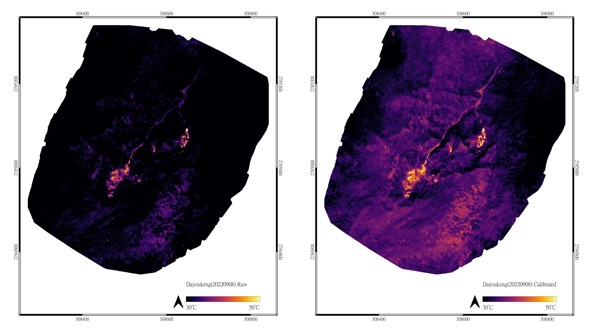
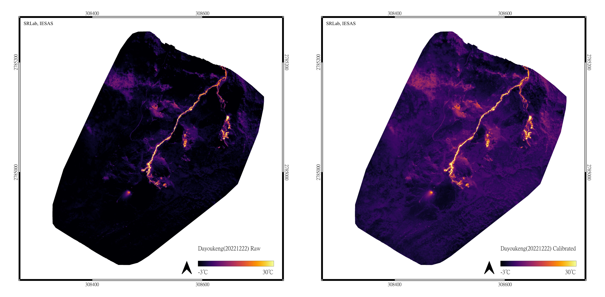
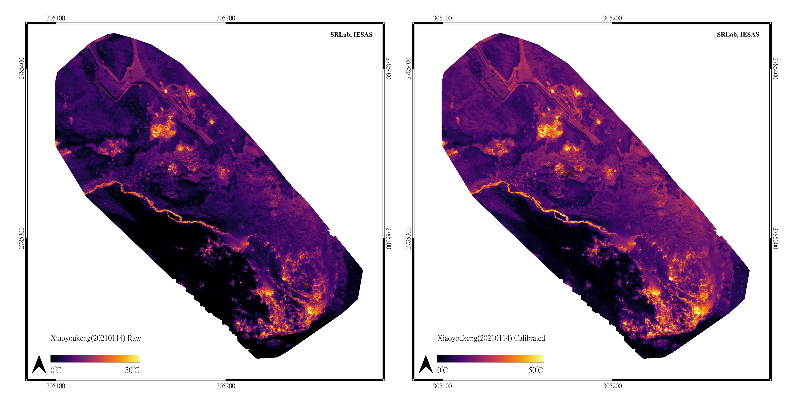
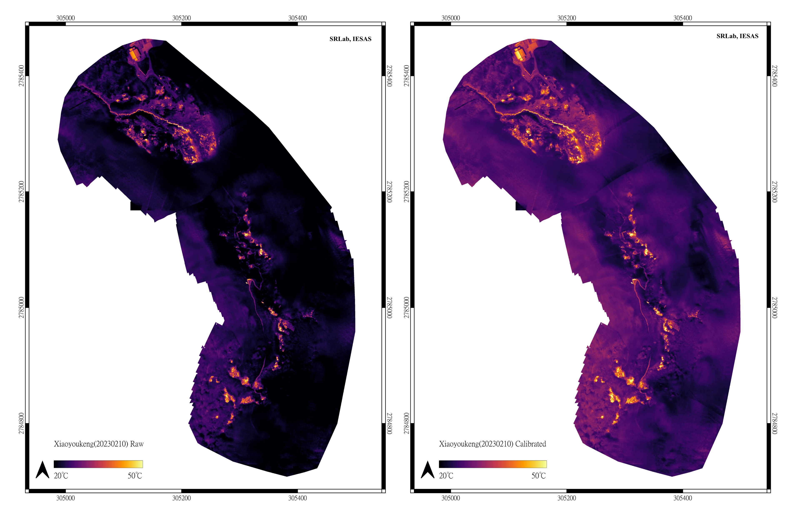

# 資料下載專頁  
本頁提供研究成果相關圖資下載服務，請根據需要在下面的內容中找到連結以下載資料。
  
## 資料授權  
本資料根據？？授權釋出。  
  
## 引用  
除已發表的期刊文章以外，使用本站下載的內容時，請以下面的引用方式合適引用本站下載的研究成果：  
  
> 詹瑜璋, “大屯火山群七星山地區之火山地形與地表溫度：以無人機載光達及熱像儀進行高解析度之調查與偵測,” 中央研究院地球科學研究所, MOST111-2740-M001-001, Sep. 2023.  
  
或以下面的 LaTex 格式輸入書目管理軟體中:  
  
```latex
@techreport{-2023,
	author = {詹, 瑜璋},
	month = {9},
	number = {MOST111-2740-M001-001},
	publisher = {中央研究院地球科學研究所},
	title = {{大屯火山群七星山地區之火山地形與地表溫度：以無人機載光達及熱像儀進行高解析度之調查與偵測}},
	year = {2023},
}
```  
  
## 成果下載  
###  論文期刊  
* [:material-link-box-outline:](https://doi.org/10.1038/s41598-023-47048-1) Chan, H.-P., Chan, Y.-C., Sun, C.-W., 2023, Thermal pattern of Tatun volcanic system by satellite-observed temperatures and its correlation with earthquake magnitudes. Scientific Reports, 13:19568. 

***  
  
###  熱影像資料   
#### 大油坑第一期成果地圖 
   
 

請點擊下列下載連結下載影像:  
[:material-checkerboard:大油坑第一期未校正影像](https://gofile.me/6TNSM/SgOX4g29l)  
[:material-checkerboard:大油坑第一期已校正影像](https://gofile.me/6TNSM/QYSILGu3d)    
  
 *** 
   
#### 大油坑第二期成果地圖   
    
 

請點擊下列下載連結下載影像:  
[:material-checkerboard:大油坑第二期未校正影像](https://gofile.me/6TNSM/XKZw8kWRF)  
[:material-checkerboard:大油坑第二期已校正影像](https://gofile.me/6TNSM/zmHGkt3DL)    
  
***

#### 小油坑第一期成果地圖    
   
 

請點擊下列下載連結下載影像:  
[:material-checkerboard:小油坑第一期未校正影像](https://gofile.me/6TNSM/8PSB0fyDC)   
[:material-checkerboard:小油坑第一期已校正影像](https://gofile.me/6TNSM/UnWldCt6r)   
  
#### 小油坑第二期成果地圖    
   
 

請點擊下列下載連結下載影像:  
[:material-checkerboard:小油坑第二期未校正影像](https://gofile.me/6TNSM/Ju7CWQ6vK)   
[:material-checkerboard:小油坑第二期已校正影像](https://gofile.me/6TNSM/q9ObJ8cM8)  


說明：  
原始溫度係儀器輸出之原始溫度，使用發射率（emmisivity）「0.95」進行溫度推算。  
校正溫度系以發射率「0.895」進行溫度[校正](https://en.wikipedia.org/wiki/Stefan%E2%80%93Boltzmann_law)後結果。  
  
  
***  

### 點雲與地形資料
本研究點雲及地形資料，請[聯絡計畫主持人並來函申請](mailto:yuchang@earth.sinica.edu.tw)。 
  