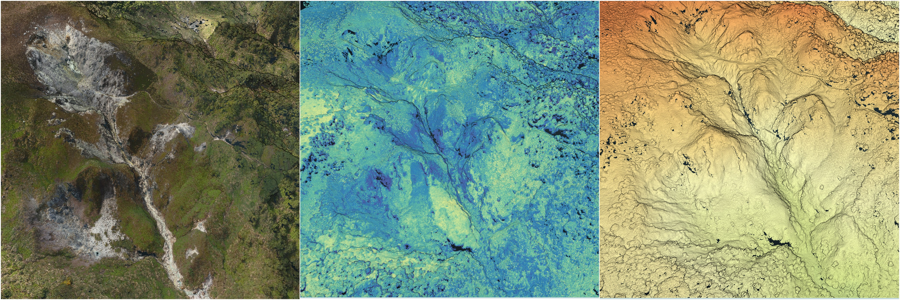

## 光達地形測繪
不同的光達技術，如地面光達、空載光達等，以主動式的測量技術，建立局部或區域的高解析度的數值地形模型，以協助火山地形的觀測，如(Mazzarini et al., 2007)以光達資料的強度與高程模型，區分出不同期熔岩流與火山地形。在大屯火山群的工作方面，陳文山等以空載光達測繪的高解析度（2m）地形資料，判識火山錐、熔岩流與火山碎屑層等火山地形，圈繪了七次主要的噴發的熔岩流位置，標示裂隙與斷層等構造（陳文山等，2007）。
  
## 無人機載光達  
無人機載光達受限於載具的硬體性能，適合較小範圍的地形測繪，本計畫針對計畫中有興趣的區域：小油坑、大油坑等區域，使用小型化的無人機載光達進行地形測繪，其主要性能如表一所載，最後產出點雲資料提供後續研究使用。
  
表一、本研究使用之光達儀器之主要參數。  
  
|項目|規格|  
|---|---|
| Scan Range（@ 0 klx）|190 m @10%reflectivity; 260 m @20% reflectivity; 450 m @80%reflectivity;|
| Field of View |70.4° (horizontal) × 4.5° (vertical)|
| Number of Returns |Triple Return|
| Scan Rate | 720,000 points/s (triple return) |
  
## 測繪成果
### 小油坑地區

圖一、小油坑地區點雲成果圖。左圖為可見光套色、中圖為強度套色、右圖為高程套色。
  
### 大油坑地區

圖二、大油坑地區點雲成果圖。左圖為可見光套色、中圖為強度套色、右圖為高程套色。

Mazzarini, F., Pareschi, M., Favalli, M., Isola, I., Tarquini, S., & Boschi, E. (2007). Lava flow identification and aging by means of lidar intensity: mount etna case. Journal of Geophysical Research Atmospheres, 112(B2). https://doi.org/10.1029/2005jb004166

陳文山, 楊志成, 楊小青, 劉進金, 詹瑜璋, 謝凱旋, & 謝有忠. (2007). 從LiDAR的2公尺×2公尺數值模擬地形分析大屯火山群的火山地形. 經濟部中央地質調查所彙刊, 20, 101–128. https://twgeoref.gsmma.gov.tw/GipOpenWeb/wSite/ct?xItem=113754&ctNode=217&mp=6