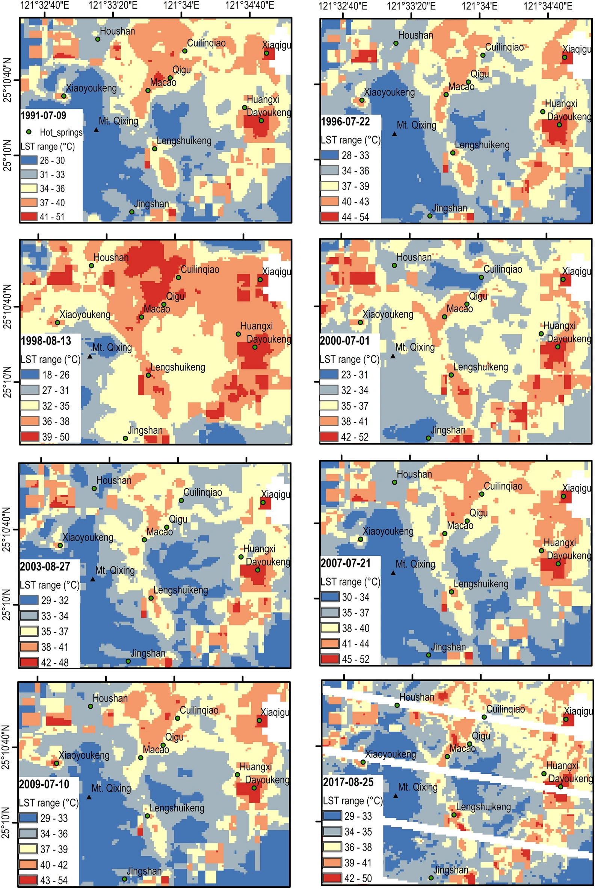
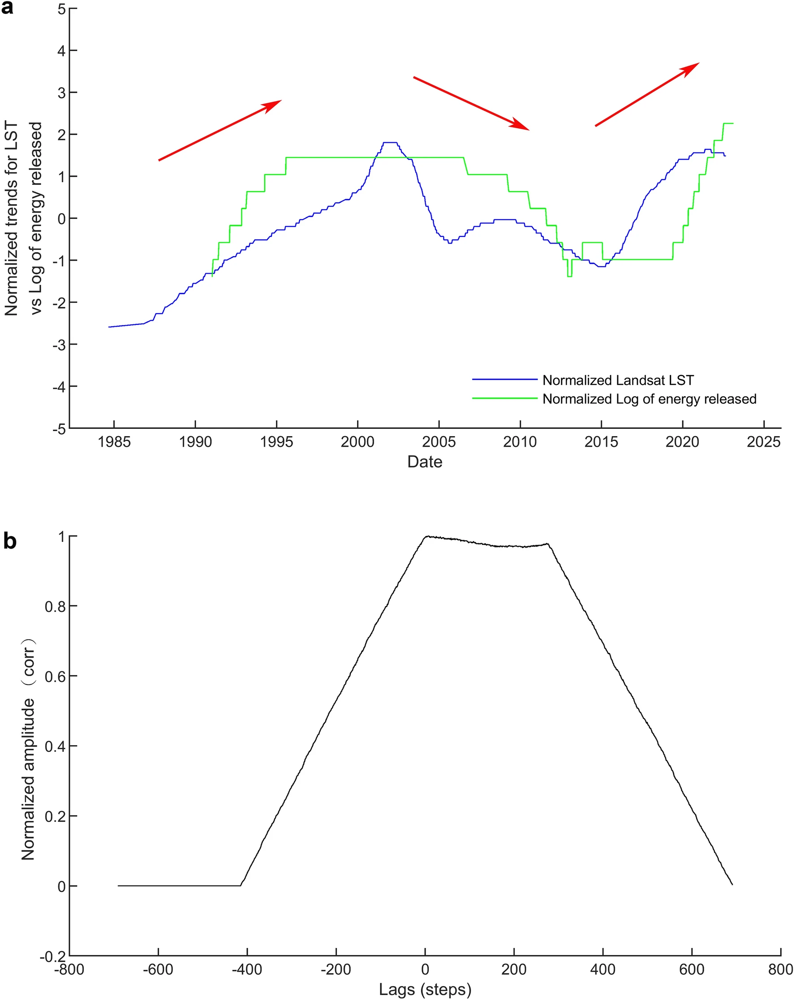

# 衛星地表溫度長期變化與火山活動之關連性
  
本研究為研究大屯火山群的長期活動，分析以衛星遙測所得之地表溫度（Land Surface Temperature，LST）約 40 年的時間序列，以及火山活動造成的地震活動約 30 年的時間序列。地表溫度時間序列顯示地表下的熱源尚未達到熱平衡而有起伏，且地表溫度與地震的時間序列呈現正相關，反應了活躍的火山活動證據。
  
本項研究成果獲得 NASA 專文介紹： [:fontawesome-solid-pen-fancy: Could Land Surface Temperature Help Predict Earthquakes?](https://landsat.gsfc.nasa.gov/article/land-surface-temperature-predict-earthquakes/)。

詳細內容請參見已發表的文章： [:material-link-box-outline:](https://doi.org/10.1038/s41598-023-47048-1) Chan, H.-P., **Chan, Y.-C.**, Sun, C.-W., 2023, Thermal pattern of Tatun volcanic system by satellite-observed temperatures and its correlation with earthquake magnitudes. Scientific Reports, 13:19568.  
  
## 精選圖片  
  
  
圖一、Landsat 觀測之大屯火山群地表溫度（LST）時間序列（自1997至2017），圖中綠點標示主要的噴氣孔或溫泉。2017年影像因傳感器故障而有資料缺失。  
  
  
圖二、正規化的 Landsat 衛星 LST 時間序列以及地震能量時間序列。上圖顯示了兩時間序列趨勢呈現正相關，紅色的箭頭指示了活動度的變化。下圖為兩時間序列的的交互相關結果。  
  
[< 回成果首頁 >](./index.md)  