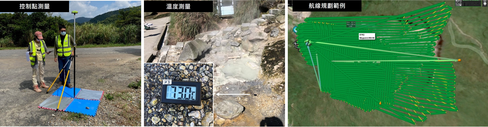
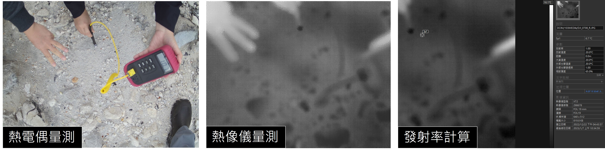
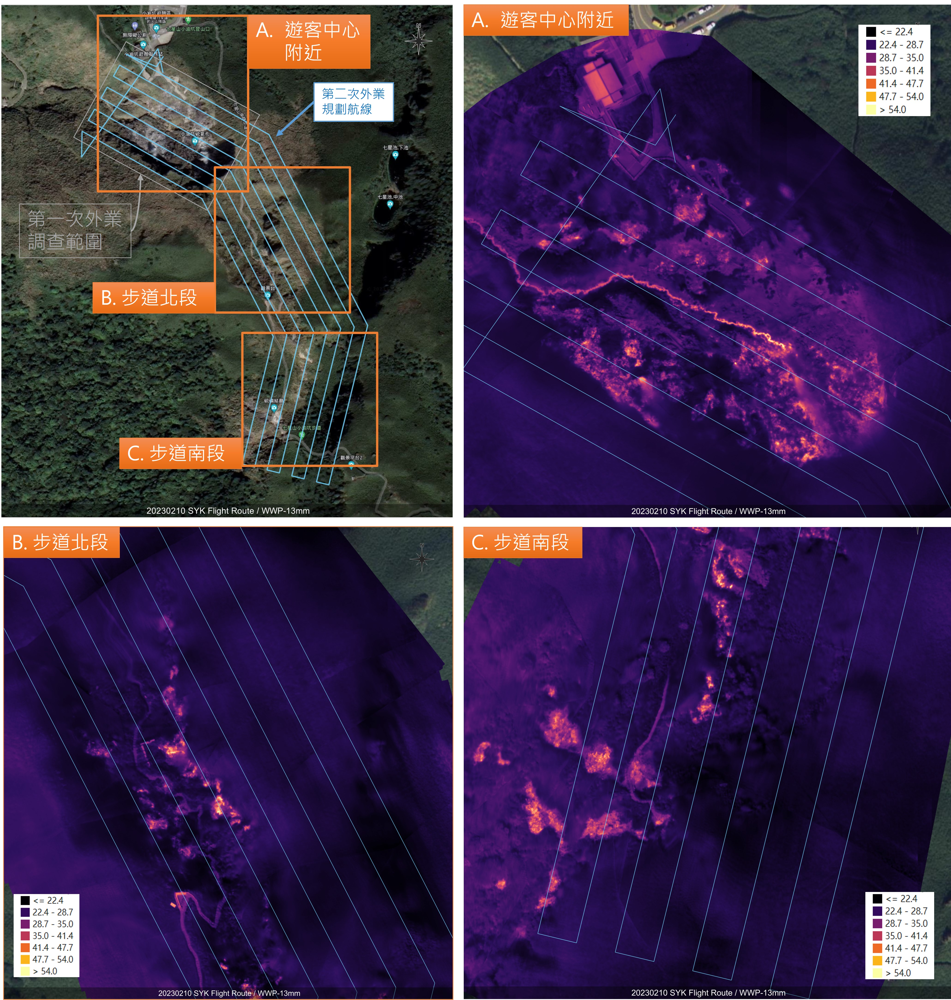
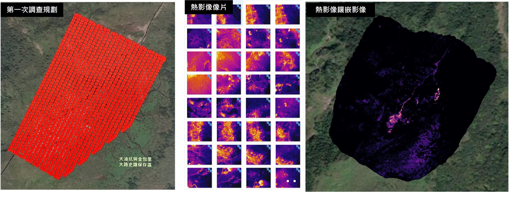
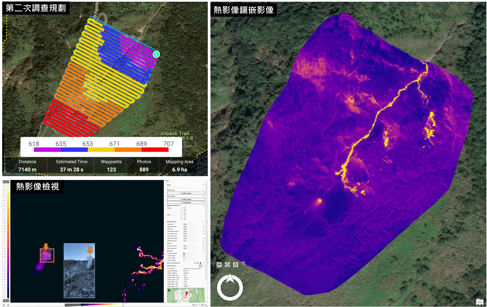

# 無人機載熱像儀地表溫度拍攝
  
  
圖一、無人機任務控制點測量與航線規劃範例。左圖為地面控制點測量。中圖為溫度控制點測量。右圖為航線規劃範例。  
  
  
圖二、熱影像現地測量與岩石表面放射率計算。左圖為接觸式溫度計測量地面溫度。中圖為熱像儀拍攝地面溫度。右圖為軟體中進行發射率（Emissivity）計算。    
  
***  

## 小油坑地區  
  
圖三、小油坑第一次地表溫度調查成果。左圖為地表溫度鑲嵌圖。右圖為座標控制點位置與溫度控制點位置。  
    
  
圖四、小油坑第二次地表溫度調查成果。左上圖為調查規劃，並分為三個地區：遊客中心、步道北段與步道南段放大檢視。右上圖為遊客中心附近地表溫度鑲嵌影像。右下圖為步道北段附近地表溫度鑲嵌影像。右下圖為步道南段附近地表溫度鑲嵌影像。  

***  

## 大油坑地區  
  
圖五、大油坑第一次地表溫度調查成果。左圖為規劃之無人機任務與拍攝之熱影像位置地圖。中圖為拍攝之部分無人機熱影像縮圖，本次任務共拍攝 1130 張像片。右圖為第一次地表溫度鑲嵌影像成果。  
   
  
圖六、大油坑第二次地表溫度調查成果。左上圖為規劃之無人機任務。左下圖為單張熱影像分析，箭頭處為大油坑之噴氣孔位置。右圖為地表溫度鑲嵌影像之成果。  

### 發射率測量成果
第二次大油坑地表溫度調查包含發射率之測量，結果如表一所示。

表一、大油坑地區地表發射率測量結果，溫度單位：攝氏度。  
  
|測量|熱電偶測量溫度|熱像儀測量溫度|發射率|
|: --- :|: --- :|: ---: |: --- :|     
|1|9.7|4.2|0.89|  
|2|12|7.1|0.89|
|3|10.7|6.7|0.9|
|4|10.1|6.1|0.9|
|平均發射率：0.895|
  
  
[< 回成果首頁 >](./index.md)  