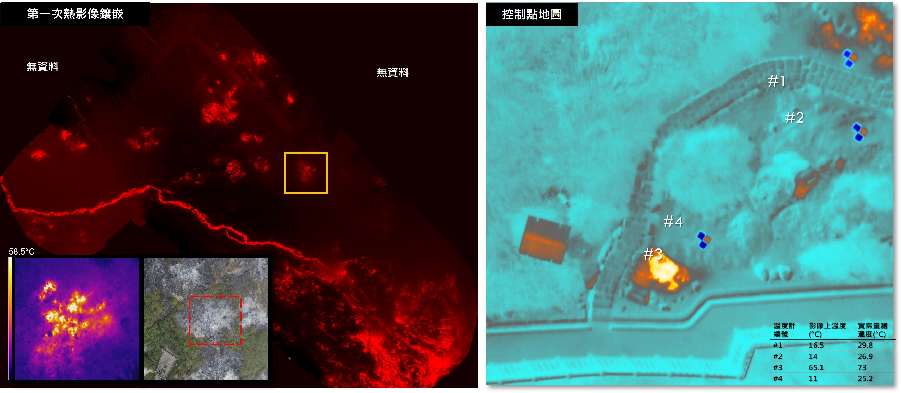

**子計畫一、大屯火山群七星山地區之火山地形與地表溫度：以無人機載光達及熱像儀進行高解析度之調查與偵測**
  
[TOC]  

# 前言  
七星山是大屯火山群最高的火山，也被多項研究認為是潛在的活動火山，然而目前僅存在解析度較低的火山地形繪製資料，而且尚未有高解析度的地表溫度分布資料。由於高解析度地形，對解析不同時期噴發的火山物質界線，有極大的影響，為了進一步繪製精確的界線，我們需要利用最新發展的無人機光達技術獲取高精度地形，以精確地解析火山噴發活動所造成的地形樣貌。此外，火山地區地表溫度的分布狀況，可以顯示目前火山熱活動的狀態，但是大屯火山群七星山地區，目前尚未有系統性的地表溫度分布觀測。因此本計畫擬以最新的無人機遙測技術，來獲取重要區域的高解析度數值地形與地表溫度資料。

# 研究成果  
本計畫研究成果著重於高解析度的資料獲取與分析，可總結為下面四大項：**火山光達地形線型判釋**、**無人機載光達地形測繪**、**無人機載熱像儀地表溫度拍攝：大油坑及小油坑**、**衛星地表溫度長期變化與火山活動之關連性**。  
  
***  
  
## 火山光達地形線型判釋  
  
[更多研究成果](./TVG_StructureDelineation.md)
***
  
## 無人機載光達地形測繪
  
  
[更多研究成果](./TVG_UAV_LiDAR.md)    
  
***

## 無人機載熱像儀地表溫度拍攝：大油坑及小油坑  
  
[更多研究成果](./TVG_UAV_Thermal.md)
  
***

## 衛星地表溫度長期變化與火山活動之關連性  
  
[更多研究成果](./TVG_LongtermObservation.md)  
  
***  
  
## 資料下載  
請至「[資料下載](./TVG_DataDownload.md)」專頁下載。  
  
*** 
   
子計畫主持人： 詹瑜璋 研究員  
研究團隊：詹海柏（博士後研究員）、孫正瑋（博士生）、羅秋月（研究助理）