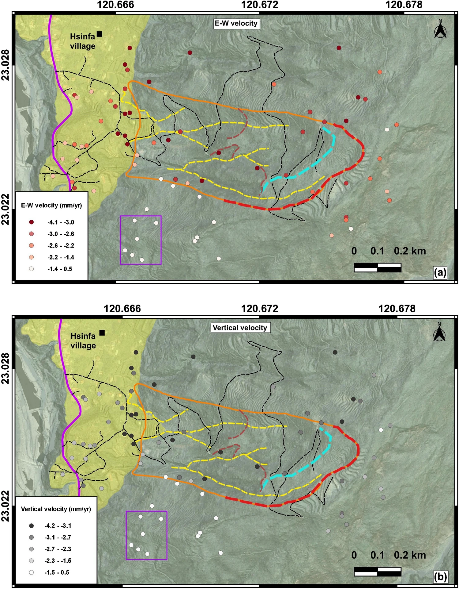

---
date:
  created: 2025-01-06 
  updated: 2025-01-06
authors:
    - SRLab
categories:
    - Journal Articles
tags:
  - Deep-seated landslides
  - Open-source geospatial tools
  - Velocity component  
  - In-situ measurements  
  - Long-term deformation monitoring  
title: Monitoring Slow-moving Landslides Using Satellite Radar and Open-source Tools (2025)
---
  
We investigate a slow-moving landslide in southern Taiwan using satellite radar data. By applying a technique called Persistent Scatterer Interferometry (PSI), we can detect very small ground movements over time with millimeter-level precision. Using five years of satellite observations (2018–2023), we find that the slope is moving slowly—only a few millimeters per year in both horizontal and vertical directions. We confirm these results with field measurements. Our study shows that combining satellite monitoring with open-source tools provides an effective and low-cost way to track landslides, helping improve hazard assessment and early warning in mountainous areas.  
  
<!-- more -->

## Abstract  
{style="width:500px", align=right}  
  
Studying slow-moving, deep-seated landslides is crucial due to their long-lasting effects on landscapes, infrastructure, and communities. In mountainous regions like Taiwan, understanding these landslides is vital for hazard mitigation and land-use planning. Over 2500 pre-existing landslides have been cataloged in Taiwan using LiDAR data, with many identified as potential slow-moving landslide zones, including a significant site, the Liugui-D047, near Hsinfa Village in southern Taiwan. This study aims to understand the E-W and vertical deformation rates at the potential landslide site using the persistent scattering interferometry (PSI) technique. PSI is particularly effective for detecting slow-moving landslides, providing millimeter-level precision in surface deformation measurements over time. By utilizing open-source tools like ISCE and StaMPS, we conducted a five-year PSI analysis from 2018 to 2023 to monitor surface movements at the site. Our results revealed minimal deformation rates, with westward movements ranging from 4.1 to 2.2 mm/yr and vertical downward movements from 4.2 to 1.4 mm/yr. These findings were validated by in situ measurements collected in 2023, confirming the observations of PSI for long-term monitoring. This highlights the effectiveness of combining PSI techniques with open-source tools for monitoring landslide sites, especially in areas with limited in-situ resources. Our study shows that this integration can yield detailed, long-term insights into surface deformations while reducing the costs of extensive in-situ monitoring. Additionally, our findings indicate that the topographically well-defined Liugui-D047 landslide site remained stable with minimal movement over five years, though ongoing monitoring is essential due to multiple influencing factors.

## Citation  
  
[:material-link-box-outline:](https://doi.org/10.1007/s10346-024-02453-z) Lakhote, A., **Chan\*, Y.-C.**, Lu, C.-Y., Kumar, G., Sun, C.-W., 2025, Monitoring slow-moving deep-seated landslide using PSI technique: a case study of a potential sliding slope from southern Taiwan. Landslides. https://doi.org/10.1007/s10346-024-02453-z. \[\*corresponding author\]