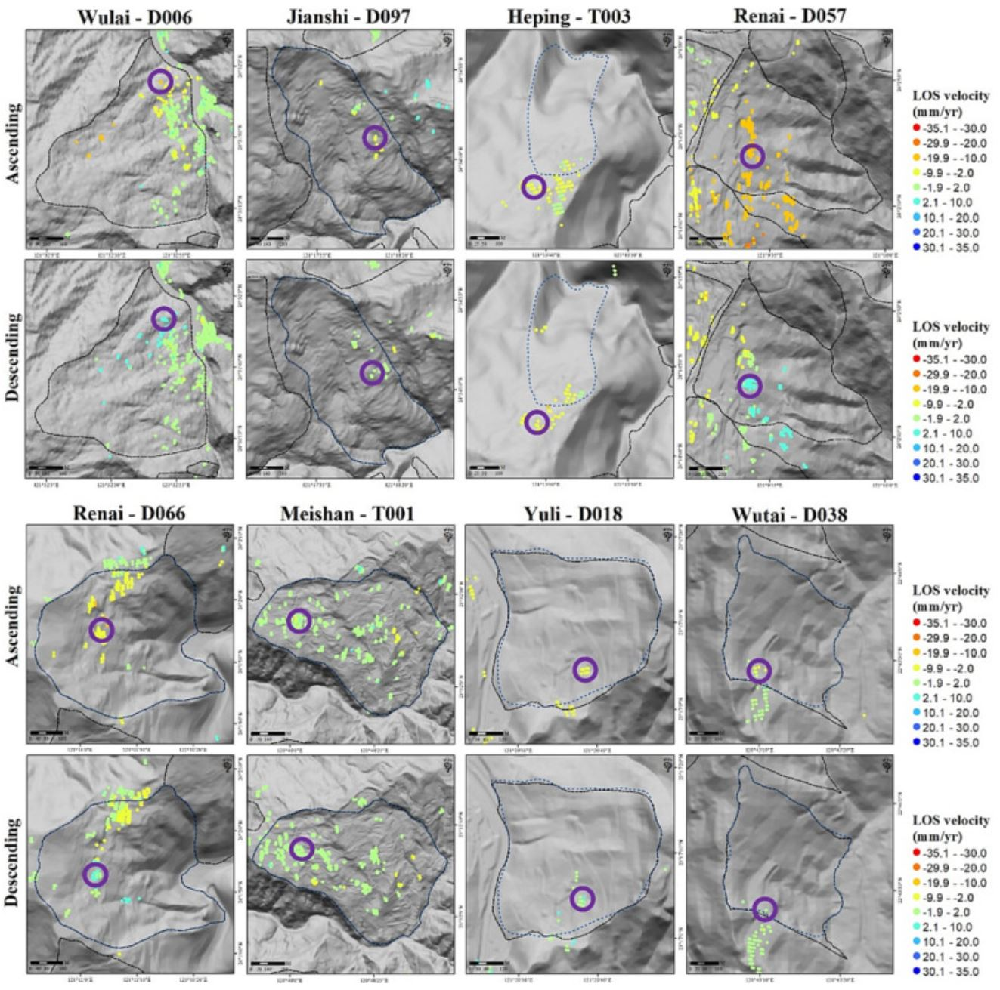

---
date:
  created: 2023-11-14 
  updated: 2023-12-11
authors:
    - SRLab
categories:
    - Journal Articles
tags:
  - Slow-moving landslides
  - Optimized MTInSAR workflow
  - Velocity distribution and movement
  - Accelerated movements
  - Seasonal fluctuation signals
title: Tracking Slow Landslide Movements with Optimized MTInSAR Workflow (2023)
---
  
This study focuses on detecting and monitoring slow-moving landslides in Taiwan using a sophisticated radar technique. Identifying over 2500 pre-existing landslides is crucial for assessing their activity, especially before typhoon seasons. The proposed method, "multi-snap2stamps," effectively analyzes nine slow-moving landslides, revealing seasonal patterns in two sites and accelerated movement in one. The study showcases the potential of the method for large-scale landslide detection and monitoring.  
  
<!-- more -->

## Abstract  
{style="width:500px", align=right}  
  
Slow-moving landslides can be found worldwide, exhibiting gradual movement over years to decades, with velocities ranging from millimeters to meters per year. However, slow-moving landslides can undergo transformation into rapid and catastrophic events, leading to severe damage to human society. Given the presence of >2500 pre-existing slow-moving landslides identified and cataloged using LiDAR bare ground data in Taiwan, it is crucial to efficiently assess their activity prior to the typhoon and heavy rainfall seasons. Therefore, a key research objective is to enhance the ability to detect landslide velocities and movements over large areas spanning tens of thousands of square kilometers. This study aims to establish a workflow that employs the multitemporal interferometric synthetic aperture radar (MTInSAR) technique for the detection and monitoring of multiple slow-moving landslides across wide regions. Specifically, we propose an optimized analysis package called “multi-snap2stamps,” based on the existing snap2stamps method, to generate interferograms for multiple regions simultaneously. Focusing on the analysis of nine pre-existing slow-moving landslides, with velocities <1.6 m/year (classified as very slow or extremely slow landslides according to established criteria), distributed across Taiwan with diverse terrain and geological conditions, this study investigates the characteristics of these deep-seated landslides using the proposed MTInSAR analysis workflow in both spatial and temporal domains. The results reveal that two slow-moving landslide sites exhibit significant seasonal signals in the time series, while seven sites do not display such signals. Additionally, the MTInSAR time series effectively captures accelerated movement in the Shiding-T001 landslide, which corresponds well with in situ inclinometer monitoring data. This study demonstrates the effective analysis of velocity distribution and movement characteristics of slow-moving landslides using the proposed MTInSAR workflow. Furthermore, it highlights the potential of this workflow for improving landslide motion detection over vast areas of interest in the future.  
  
## Citation  
  
[:material-link-box-outline:](https://doi.org/10.1016/j.enggeo.2023.107339) Lu\*, C.-Y., **Chan\*, Y.-C.**, Hu, J.-C., Chiu, C.-Y., Chu, C.-R., Tseng, C.-H., Chang, C.-H., 2023, "Velocity distribution and movement of multiple slow-moving landslides characterized by an optimized MTInSAR workflow", Engineering Geology, 2023, 327, 107339.[*corresponding author]