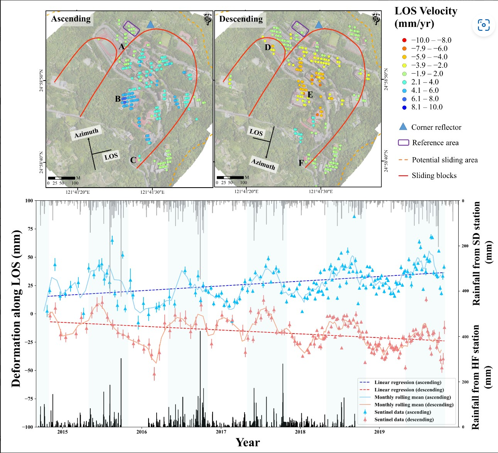

---
date:
  created: 2021-10-06 
  updated: 2024-02-26
authors:
    - SRLab
categories:
    - Journal Articles
tags:
  - Slow-moving landslides
  - seasonal surface fluctuation
  - gravity-induced deformation
  - multitemporal interferometry (MTI)
  - Huafan University campus
title: Seasonal surface fluctuation of a slow-moving landslide detected by multitemporal interferometry (MTI) on the Huafan University campus, northern Taiwan (2021)
---
  
A long-term landslide on the Huafan University campus in Taiwan, observed since 1990, lacks reliable monitoring data post-2018 due to equipment maintenance issues. This study employs multitemporal interferometry (MTI) using Sentinel-1 SAR images from 2014–2019 to monitor the landslide. MTI reveals consistent slow-moving areas with previous studies, indicating gravity-induced deformation and seasonal surface fluctuations linked to precipitation. This technique compensates for the lack of data and aids in evaluating and monitoring landslides for potential early warnings. 
  
<!-- more -->

## Abstract  
{style="width:500px", align=right}  
  
A slow-moving landslide on the Huafan University campus, which is located on a dip slope in northern Taiwan, has been observed since 1990. However, reliable monitoring data are difficult to acquire after 2018 due to the lack of continuous maintenance of the field measurement equipment. In this study, the multitemporal interferometry (MTI) technique is applied with Sentinel-1 SAR images to monitor the slow-moving landslide from 2014–2019. The slow-moving areas detected by persistent scatterer (PS) pixels are consistent with the range of previous studies, which are based on in situ monitoring data and field surveys. According to the time series of the PS pixels, a long period gravity-induced deformation of the slow-moving landslide can be clearly observed. Moreover, a short period seasonal surface fluctuation of the slow-moving landslide, which has seldom been discussed before, can also be detected in this study. The seasonal surface fluctuation is in-phase with precipitation, which is inferred to be related to the geological and hydrological conditions of the study area. The MTI technique can compensate for the lack of surface displacement data, in this case, the Huafan University campus, and provide information for evaluating and monitoring slow-moving landslides for possible landslide early warning in the future.
  
## Citation  
  
1. [:material-link-box-outline:](https://doi.org/10.3390/rs13194006) Lu, C.-Y., **Chan\*, Y.-C.**, Hu, J.-C., Tseng, C.-H., Liu, C.-H., Chang, C.-H., 2021, "Seasonal surface fluctuation of a slow-moving landslide detected by multitemporal interferometry (MTI) on the Huafan University campus, northern Taiwan", Remote Sensing, 2021, 13, 4006. https://doi.org/10.3390/rs13194006 [*corresponding author]