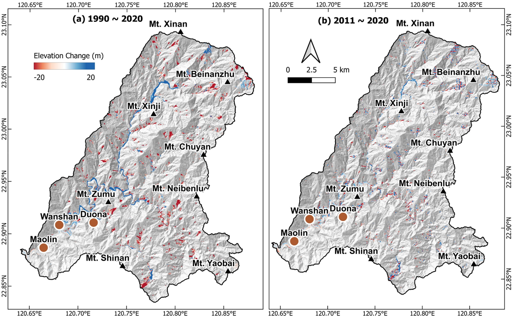

---
date:
  created: 2024-05-29 
  updated: 2024-07-03
authors:
    - SRLab
categories:
    - Journal Articles
tags:
  - DEMs of difference (DoD)
  - digital elevation model (DEM)
  - DEM vertical referencing
  - Fourier transformation & spectral analysis
  - sediment export & erosion rate
title: "Assessing Decadal Sediment Erosion Rates: Insights from Improved DEMs of Differencing (2024)"
---
  
This study examines sediment erosion in Taiwan's Zhoukou River Basin over the past 30 years, focusing on the impact of extreme rainfall. Traditional methods measure erosion over different time scales, but we used a unique approach for decade-long calculations with global and regional digital elevation models (DEMs). Our new method, applying Fourier analysis, reduces vertical bias in DEMs. Spectral analysis helps correct vertical offsets. Erosion rates calculated through DEMs of Difference (DoD) show a significant drop in sediment export from 1990-2010 to 2011-2020 due to reduced extreme rainfall. The denudation rate decreased from 14.19 mm/yr to 10.46 mm/yr in the Zhoukou River Basin. Our method effectively estimates sediment transport rates using underutilized DEMs.  
  
<!-- more -->

## Abstract  
{style="width:500px", align=right}  
This study assesses sediment erosion rates in the Zhoukou River Basin in southern Taiwan over the past three decades, focusing on the impact of extreme rainfall events. While various established methods determine erosion rates over different temporal scales, we employ an independent approach for decadal-scale erosion rate calculation by utilizing open-source global and regional digital elevation models (DEMs) data for two distinct periods. We introduce a new method that applies Fourier analysis to vertically register the DEMs, significantly minimizing their vertical bias. Through spectral analysis, we identify long wavelength topography crucial for correcting vertical offsets. Erosion rates, computed through DEMs of Difference (DoD), exhibit a similar trend of significant reduction in sediment export rates from 1990–2010 to 2011–2020 due to decreased extreme rainfall events, aligning with erosion rate estimates derived from mean suspended load data at gauge stations. Over the entire period from 1990 to 2020, the calculated denudation rate was 14.19 mm/yr, whereas in the recent decade (2011–2020), it decreased to 10.46 mm/yr. Our study suggests that the improved DoD method can effectively estimate sediment transport rates by leveraging underutilized DEMs captured at distinct points in time, especially when the erosional signal dominates data noise.  

  
## Citation  
  
[:material-link-box-outline:](https://doi.org/10.1080/19475705.2024.2363428) Kumar, G., **Chan\*, Y. C.**, Sun, C. W., & Chen, C. T. (2024). Decadal-scale assessment of sediment denudation rates in the Zhoukou River Basin, Taiwan: insights from improved DEMs of differencing based on spectral analysis. Geomatics, Natural Hazards and Risk, 15(1). https://doi.org/10.1080/19475705.2024.2363428  

