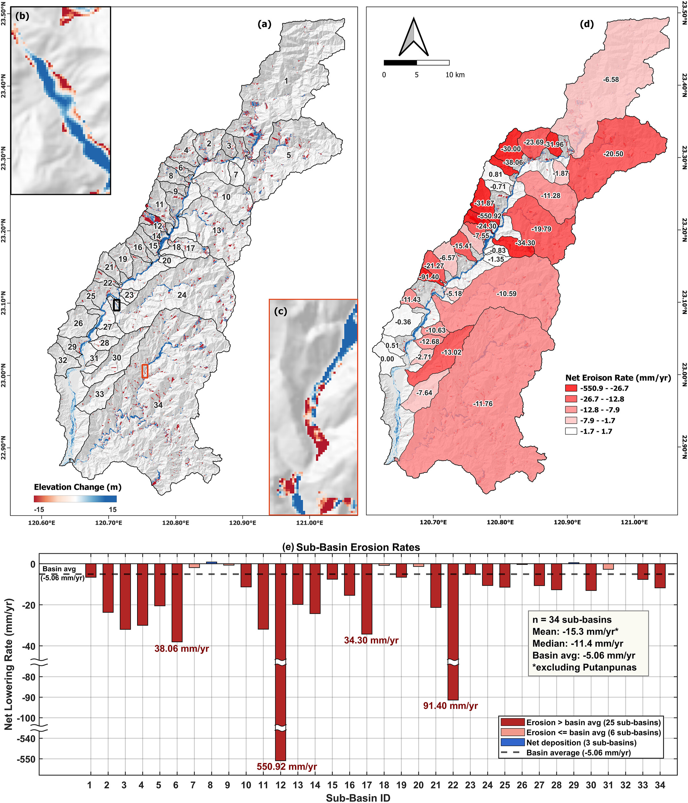

---
date:
  created: 2026-04-21 
  updated: 2024-05-18
authors:
    - SRLab
categories:
    - Journal Articles
tags:
  - DEMs of difference (DoD)
  - Spectral analysis
  - Decadal erosion rates
  - Sediment buffering

title: "Decadal Erosion Rates and Sediment Buffering Identified Through Enhanced DEM Differencing (2026)"
---
  
Climate change is increasing extreme rainfall and landslides in mountain regions, raising concerns about accelerated erosion. Our study in Taiwan’s Laonong Basin combined satellite-derived elevation data with local Lidar data to examine how rapidly the landscape is changing. We found that decadal erosion rates are about 5 millimeters per year, similar to geological rates measured over thousands to millions of years. This suggests that sediment produced by storms and landslides is often temporarily stored in valleys as we have found before being transported downstream, helping maintain long-term erosion balance. Our study also identified smaller areas with much higher erosion rates, highlighting localized landslide hazards and demonstrating the value of enhanced elevation differencing data for monitoring landscape change.  

氣候變遷讓極端降雨和山崩變得更頻繁，也讓山區侵蝕速度更受關注。我們以臺灣荖濃溪流域為例，結合衛星高程資料與在地光達資料，來看近幾十年的地形變化。結果發現，流域平均侵蝕速率大約是每年 5 毫米，和長時間（幾千到幾百萬年）的地質估算其實很接近。這表示雖然暴雨和崩塌會帶來大量土砂，但這些物質常會先暫時堆在河谷或沖積扇，再慢慢被搬運出去，所以長期來看侵蝕還是維持平衡。不過在一些子流域，侵蝕速度明顯更高，顯示局部仍有較強的山崩風險。這也說明改良後的高程差分資料，在監測山區地形變化和災害評估上很有幫助。
  
<!-- more -->

## Abstract  
{style="width:500px", align=right}  
Quantifying decadal-scale erosion rates in tectonically active regions is essential for assessing landscape hazards and constraining sediment budgets. A key question in Earth surface processes is how contemporary erosion measurements influenced by recent climatic extremes relate to long-term geological rates. This study investigates this relationship by evaluating two decades of topographic change (2000–2020) in Taiwan's Laonong River Basin (1,373 km2), a mountainous landscape characterized by active landslides, steep relief, and intense rainfall, including Typhoon Morakot in 2009, the highest-rainfall typhoon on record in Taiwan. Several satellite-derived digital elevation models (DEMs) were benchmarked against high-resolution LiDAR to identify the most suitable data set for long-term change detection. The reprocessed SRTM NASADEM was identified as the optimal DEM due to minimal artifacts and limited void filling, with further improvement achieved through canopy removal and frequency-domain bias correction. DEM differencing across sub-catchments revealed that erosion rates averaged ∼15.3 mm/yr, reaching ∼551 mm/yr in landslide-affected tributaries. However, approximately 87.6% of the eroded material was stored within the basin, predominantly in valley-fill deposits, reducing effective net lowering across the basin to 5.06 ± 1.60 mm/yr. This rate is consistent with long-term (103–106 yr) cosmogenic and thermochronological estimates (∼3–6 mm/yr), indicating that sediment buffering spatially averages extreme localized erosion over decadal timescales. These findings highlight the role of internal sediment storage in shaping basin-scale erosion patterns and emphasize the importance of high-resolution erosion assessments for capturing geomorphic heterogeneity. The results also demonstrate the potential of underutilized global DEMs, once corrected, to resolve meaningful geomorphic signals in mountainous terrain.

  
## Citation  
  
[:material-link-box-outline:](https://doi.org/10.1029/2025JF008720) Kumar, G., **Chan\*, Y.-C.**, Sun, C.-W., Chen, C.-T., 2026, Decadal Erosion rates and sediment buffering identified through enhanced DEM differencing using underutilized global satellite DEMs. Journal of Geophysical Research: Earth Surface, 131, e2025JF008720. [https://doi.org/10.1029/2025JF008720](https://doi.org/10.1029/2025JF008720)

