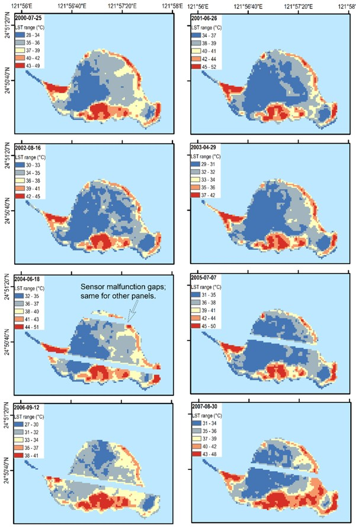

---
date:
  created: 2023-07-25 
  updated: 2023-12-11
authors:
    - SRLab
categories:
    - Journal Articles
tags:
    - kueishantao(KST)
    - satellite observation, 
    - land surface temperature(LST), 
    - geothermal resources, 
    - landsat, 
    - MODIS, 
    - ASTER

title: "Satellite Study: Thermal Patterns at Kueishantao Volcano, Taiwan (2023)"
---
  
This research investigates the geothermal state of Kueishantao (KST) volcano in Taiwan using satellite-observed land surface temperature (LST). Analyzing LST anomalies from 1999 to 2022, the study reveals increasing temperatures in the southeast, correlating with potential magma reservoirs. The non-linear thermal pattern suggests dynamic subsurface activity, providing insights for geothermal resource management.
  
<!-- more -->  
## Abstract  
{style="width:500px", align=right}  
    
Kueishantao (KST) is an active volcanic island off the northeastern coast of Taiwan. Tectonically, it lies in the south of the Okinawa Trough and opposite to the Ilan plain, in which is the southwestern end of the trough. KST provides a convenient observation site for the subsurface geological and geothermal activity and mechanism at its proximity. Land surface temperature (LST) of volcanoes detected from satellite sensors reflects the thermal status of heat sources in the subsurface. LST thus is a key parameter to the understanding of the volcanic process and geothermal resources. This research utilizes the satellite-observed multi-temporal land surface temperature imagery in 1999–2022 on the Kueishantao volcano of Taiwan to explore its geothermal state. The U.S. NASA Earth-observing satellites onboard three thermal sensors (i.e., Landsat ETM+, Terra ASTER, and Aqua/Terra MODIS) derived time series of land surface temperature from 1999 are employed to define the past and current pattern of geothermal activity plus the future trend of the KST. The spatiotemporal LST distribution of KST volcano is explored and analyzed. The spatial LST distribution of the KST volcano indicates that LST anomaly areas are mainly located on the southeast island, which is well correlated with the possible magma reservoir location from previous geophysical and geological surveys. An increasing trend of two-decade LST time series is revealed from all three thermal sensors. The retrieved surface thermal pattern shows non-linear temperature variations that imply the non-steady-state nature of the subsurface thermal sources at this volcano. In summary, satellite LST observations facilitate the understanding on the subsurface magmatic processes of active volcanoes for further management of geothermal resources.  
  
## Citation  
  
[:material-link-box-outline:](https://doi.org/10.1088/2515-7620/ace760) Chan, H.-P., **Chan, Y.-C.**, 2023, Thermal pattern at kueishantao (KST) volcano of Taiwan from satellite-observed temperatures and its implication. Environmental Research Communications, 5, 075013.    