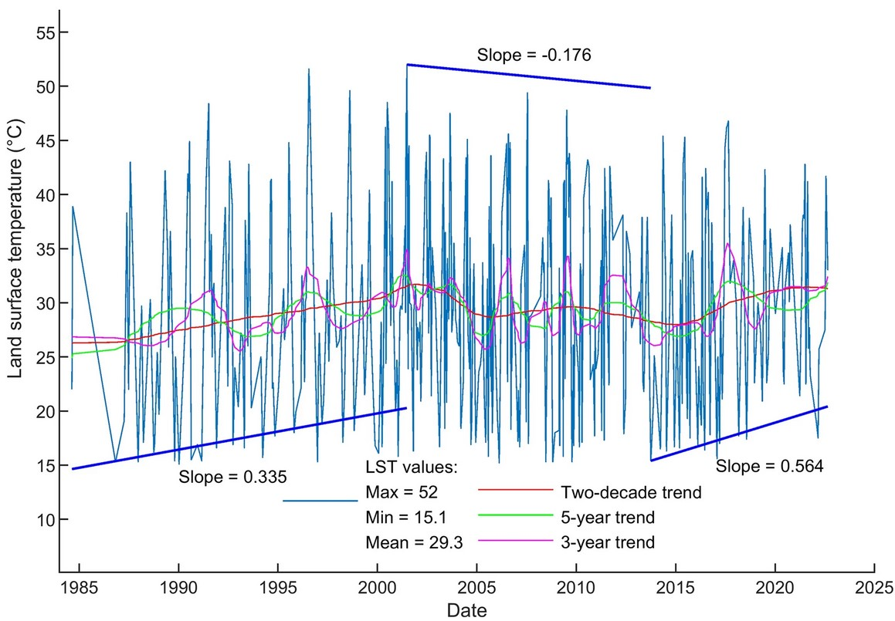

---
date:
  created: 2023-11-10 
  updated: 2023-12-11
authors:
    - HPChan
categories:
    - publication
tags:
    - Environmental sciences
    - Natural hazards
    - Solid Earth sciences

title: Chan. et. al., 2023, Thermal pattern of Tatun volcanic system by satellite-observed temperatures and its correlation with earthquake magnitudes 
---
## Selected Figure 
  

  
<!-- more -->  
## Abstract  
  
The land surface temperature (LST) of volcanoes detected from satellite sensors reflects the thermal status of heat sources in the subsurface. Volcanic earthquakes occur as magma and volcanic fluids transport to the surface from depth. Thus, both LST and earthquake magnitude are key parameters to the study of active volcanoes. Here we investigate the volcanic status of Tatun Volcanic Group (TVG) based on LST and seismic observations. The Earth-observing satellites onboard thermal sensor derived land surface temperature, and the seismic records retrieved volcanic earthquake magnitude are used to delineate the past and current pattern of volcanic activity plus the future trend of the TVG. The spatiotemporal distribution of LST and volcanic earthquake magnitude in TVG are analyzed. The high-similarity trends of the 4-decade LST time series and 3-decade earthquake magnitude time series are inspected. The retrieved surface thermal pattern shows the non-steady-state nature of the subsurface thermal sources at this volcanic complex. The LST trend exhibits a rather positive correlation with the energy released from volcanic earthquakes and consequently, the presumption on the connection between LSTs and earthquakes is validated.