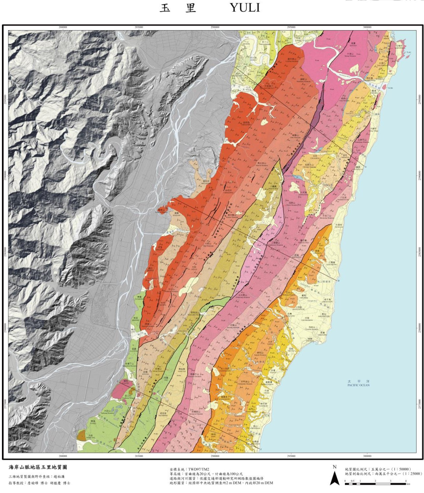
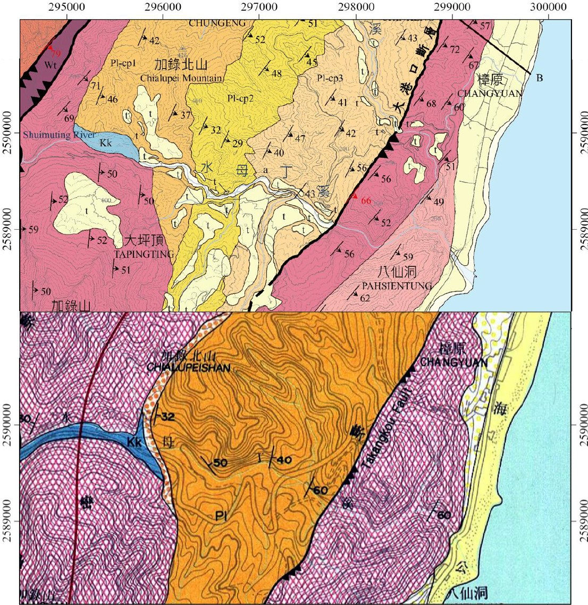

---
date:
  created: 2021-06-30
  updated: 2023-12-12
authors:
    - SRLab
categories:
    - Thesis
tags:
    - 

title: "(M. Sc. Thesis) Improving Geologic Maps with LiDAR DEM: Yuli Coastal Range (2021)"
---
   
(Master thesis, 2021: Chao, Po-Lien) Using high-resolution DEM derived from LiDAR in Taiwan's Coastal Range, this study overcame challenges in geologic mapping caused by dense vegetation and steep terrain. The mapping method successfully identified features in both igneous and sedimentary rock, revealing new structures like shear zones, faults, and monoclines. The results, including a 1:50000 geologic map and profiles, showcase the potential of this approach for geological studies and engineering applications.  
  
<!-- more -->  
  
**Geologic map of Yuli based on LiDAR DEM**  
  
{style="width:600px"}    

**Comparison of our work (upper) and previous map (lower)**  
  
{style="width:600px"}  

## Citation    
[:material-link-box-outline:](https://doi.org/10.6342/NTU202101583)趙柏濂（2021）。應用空載光達數值地形精進火成岩與沉積岩混合區地質圖：以海岸山脈地區玉里地質圖幅為例〔碩士論文，國立臺灣大學〕。https://doi.org/10.6342/NTU202101583  
