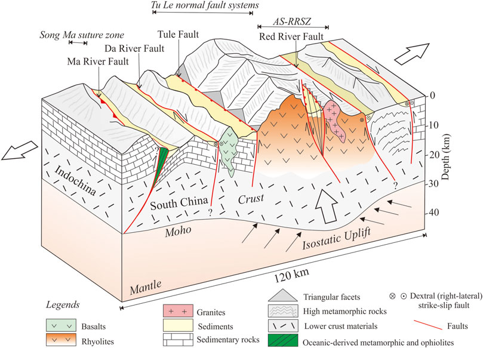

---
date:
  created: 2022-01-21
  updated: 2023-12-12
authors:
    - SRLab
categories:
    - Journal Articles
tags:
    - stream-length gradient index
    - normalized steepness index (ksn)
    - Fansipan and Tule mountain ranges
    - mountain uplift
    - isostatic rebound

title: "Tectonic Uplift in Fansipan and Tule Mountains, Northern Vietnam (2022)"
---
   
The high elevations of Fansipan and Tule mountain ranges in northern Vietnam, adjacent to the Red River Fault, are influenced by active fault systems. Field and DEM data, along with geomorphic analyses, reveal potential normal and strike-slip faults, suggesting recent movements dominated by strike-slip and normal faulting. Extensional tectonics, particularly isostatic rebound, are proposed mechanisms for sustaining mountain elevations despite monsoon-driven weathering.
   
<!-- more -->  
## Abstract  
{style="width:500px", align=right}  
    
The Fansipan and Tule mountain ranges, northern Vietnam, are regions with high elevations and are adjacent to the Red River Fault, which is an important structure that is related to the India-Eurasia collision. How mountain elevations are maintained today under a humid subtropical climate is important for improving the knowledge of the tectonic deformations in northern Vietnam and may have broader implications for the crustal dynamics of circum-Tibetan regions. We therefore utilized observations from field and digital elevation model (DEM) data and geomorphic analyses to constrain the active fault systems that have likely contributed to the uplift of mountain ranges. Our observations from DEM and field data indicate potential active normal and strike-slip faults such as the Phong Tho-Nam Pia Fault, Tule Fault, and Nghia Lo Fault. In addition to these observations, the results from geomorphic indices, which include both the stream-length gradient index (SL) and normalized steepness index (ksn), present high values for the footwalls of the inferred normal faults and low values for the hanging walls. Most of the identified knickpoints are related to the locations of mapped faults. Correlations of these data indicate that recent movements of the Fansipan and Tule mountain ranges are dominated by strike-slip and normal faulting under a NE-SW minimum extensional regime. We therefore propose that extensional tectonics associated with isostatic rebound likely plays a role in maintaining mountain elevations over long periods despite the continuous weathering and erosion present in monsoon-affected areas.  
    
## Citation  
[:material-link-box-outline:](https://doi.org/10.3389/feart.2021.741670) Dinh, T.-H., **Chan\*, Y.-C.**, Chen, C.-T., 2022, Extensional Tectonics and Basement Uplift of the Fansipan and Tule Mountain Ranges in Northern Vietnam, Frontiers in Earth Science, \[\*corresponding author\]   